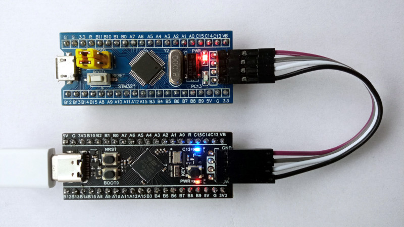

# Converting a Black Pill to a Black Magic Probe

[](https://raw.githubusercontent.com/koendv/blackmagic-blackpill/main/pictures/black_debugging_blue.jpg)

This document shows how to convert a [STM32F411 Black Pill](https://www.aliexpress.com/item/1005001456186625.html) to a [Black Magic Probe](https://github.com/blackmagic-debug/blackmagic) debugger. A Black Magic Probe (BMP) debugger allows you to download firmware over SWD or JTAG, to set breakpoints, and inspect variables. It is a cheap and convenient tool for debugging programs on arm processors.

## Installing Firmware
Download and unzip the [firmware](https://github.com/koendv/blackmagic-blackpill/releases). Set up a STM32F411 Black Pill for dfu firmware upload:

- connect the STM32F411 Black Pill to a usb port
- push button BOOT0
- push button NRST
- release button NRST. wait one second.
- release button BOOT0. wait one second.
- check the device is in DFU mode:

```
 $ lsusb
Bus 001 Device 011: ID 0483:df11 STMicroelectronics STM Device in DFU Mode
```
- flash using:

```
dfu-util -a 0 --dfuse-address 0x08000000 -D blackmagic.bin
```

- push reset
- check the black magic probe shows up on usb:
```
 $ lsusb
Bus 001 Device 012: ID 1d50:6018 OpenMoko, Inc. Black Magic Debug Probe (Application)
```
Your debugger is now ready for use.

## Linux

If you are running linux, download the [udev rules for the BMP](https://github.com/blackmagic-debug/blackmagic/blob/master/driver/99-blackmagic.rules) and install them in
 `/etc/udev/rules.d/99-blackmagic.rules`:

```
$ wget https://github.com/blackmagic-debug/blackmagic/raw/master/driver/99-blackmagic.rules
$ sudo cp 99-blackmagic.rules /etc/udev/rules.d/
$ sudo chown root:root /etc/udev/rules.d/99-blackmagic.rules
$ sudo chmod 644 /etc/udev/rules.d/99-blackmagic.rules
$ sudo udevadm control --reload-rules
```

Disconnect and re-connect the debugger probe. Check the device shows up in /dev/:

```
$ ls -l /dev/ttyBmp*
lrwxrwxrwx 1 root root 7 Mar 24 11:59 /dev/ttyBmpGdb -> ttyACM0
lrwxrwxrwx 1 root root 7 Mar 24 11:59 /dev/ttyBmpTarg -> ttyACM1
```

## Connecting to target

As target system we use a stm32f103 Blue Pill. Connect BMP and target like this:

Black Magic Probe |  Target | Comment |
---|---|---
stm32f411 |  stm32f103 |  |
`GND` | `GND`
`SWDIO` | `SWDIO` | Serial Wire Debugging Data
`SWCLK` | `SWCLK` | Serial Wire Debugging Clock
`3V3` | `3V3` | Careful! Only connect one power source.

Your setup ought to look like the picture above.

Careful - connect only one power source to a board. If in your setup Black Magic Probe and target are both connected to usb, the connection between Black Magic Probe and target should be  `SWDIO`, `SWCLK` and `GND` only. No `3V3` power.

Connect the Black Magic Probe usb to the PC.  Now we are ready to connect to the target system:

```
$ arm-none-eabi-gdb
(gdb) target extended-remote /dev/ttyBmpGdb
Remote debugging using /dev/ttyBmpGdb
(gdb) monitor swdp
Target voltage: unknown
Available Targets:
No. Att Driver
1      STM32F1 medium density M3/M4
(gdb) attach 1
(gdb) run
```

See the [overview of useful gdb commands](https://github.com/blackmagic-debug/blackmagic/wiki/Useful-GDB-commands) for an  introduction to using the BMP. If you want more in-depth information, read the [Black Magic Probe Book](https://github.com/compuphase/Black-Magic-Probe-Book).

## stm32duino

If you are using the Arduino IDE with the [stm32duino](https://github.com/stm32duino/wiki/wiki/Getting-Started) arm processor add-on:

In the Arduino IDE, choose *Tools->Upload Method-> BMP (Black Magic Probe)* to upload firmware using the BMP.  This uploads the firmware using the `arm-none-eabi-gdb` command. The command line options to  `arm-none-eabi-gdb` are in the *tools.bmp_upload* section of `~/.arduino15/packages/STMicroelectronics/hardware/stm32/2.0.0/platform.txt`

When debugging arm processors, there are three ways for the target to print debug messages on the host: Semihosting, Serial Wire Output SWO, and Real-Time Transfer RTT. There are three Arduino libraries that may be useful:

* [SerialWireOutput](https://github.com/koendv/SerialWireOutput)
* [STM32duino-Semihosting](https://github.com/koendv/STM32duino-Semihosting)
* [RTTStream](https://github.com/koendv/Arduino-RTTStream)

## risc-v

The firmware _riscv.zip_ has added experimental support for selected risc-v processors. This is [work in progress](https://github.com/blackmagic-debug/blackmagic/pull/924).

_not truncated_
